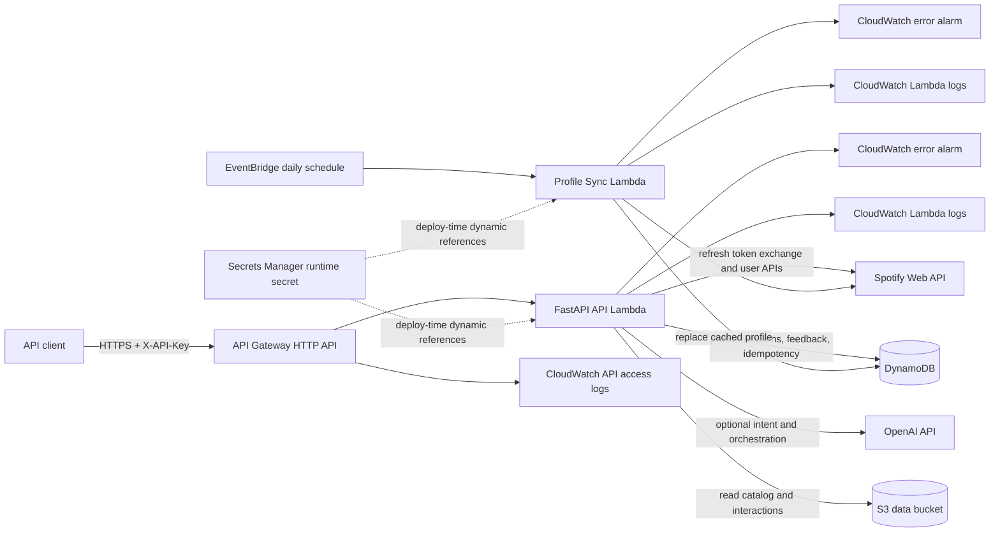

# AWS Deployment Architecture Runbook

This document describes the architecture implemented by `infra/template.yaml` and deployed as
CloudFormation stack `music-recommender-demo` in AWS account `571600852509`, region `us-east-1`.
It supersedes the proposed online architecture in `recommender-architecture.md` for operational
decisions.

Current API URL: `https://4bds6ddj39.execute-api.us-east-1.amazonaws.com/`.

## Product Boundary

The deployment is a backend-only, single-Spotify-user product. It includes authenticated API
access, live profile refresh, catalog ranking, feedback capture, and private/public playlist
creation. It does not include a frontend, custom domain, Cognito, per-customer Spotify OAuth, or
tenant isolation.

## Component Topology



## Deployed Resources

| Resource | Configuration | Responsibility |
| --- | --- | --- |
| API Gateway HTTP API | `$default` stage | Routes all root and proxy requests to FastAPI |
| API Lambda | Python 3.12, x86_64, 1024 MB, 30 seconds | API key enforcement, profile calls, ranking, feedback, playlists |
| Profile sync Lambda | Python 3.12, x86_64, 512 MB, 90 seconds | Scheduled Spotify profile refresh |
| EventBridge rule | `cron(0 10 * * ? *)` by default | Invokes profile sync daily at 10:00 UTC |
| Users DynamoDB table | Partition key `user_id` | Cached Spotify profile snapshot |
| Sessions DynamoDB table | Partition key `session_id` | Recommendation inputs, outputs, and playlist result |
| Feedback DynamoDB table | Partition key `session_id`, sort key `event_key` | Append-style feedback events |
| Playlists DynamoDB table | Partition key `session_id` | Spotify playlist idempotency record |
| S3 data bucket | `music-recommender-571600852509-us-east-1` | Versioned catalog and offline interaction runs |
| Secrets Manager | `music-recommender/demo/runtime` | API key, Spotify OAuth values, OpenAI API key |
| CloudWatch logs | 14-day retention | HTTP access and Lambda execution logs |
| CloudWatch alarms | Error count greater than zero over 5 minutes | API and scheduled Lambda failure signals |

All four DynamoDB tables use on-demand billing, server-side encryption, point-in-time recovery, and
CloudFormation retain policies for deletion and replacement.

## API Request Flow

1. API Gateway sends the request to the FastAPI Lambda through the root or proxy route.
2. FastAPI allows `/health`, `/docs`, `/redoc`, and `/openapi.json` without a key. Other paths are
   compared against `RECOMMENDER_API_KEY` using a constant-time comparison.
3. The API Lambda loads deployment settings from environment variables.
4. Recommendation calls read the selected catalog and interaction run from S3, then merge unique
   tracks captured in the cached Spotify profile.
5. The ranker uses the cached profile in DynamoDB, plus any request-level profile additions.
6. Requests with `use_openai_agent: true` call OpenAI for intent parsing and orchestration. The
   deterministic ranking tool and track-ID guardrail remain authoritative.
7. The complete recommendation response is stored in the sessions table before it is returned.
8. Feedback and playlist requests validate their session and track IDs against that stored result.
9. Playlist creation exchanges the Spotify refresh token and uses the Spotify Web API. Its result is
   stored by session ID so retries do not create duplicate playlists.

## Profile Refresh Flow

Manual `POST /profile/sync` and the EventBridge-triggered Lambda use the same profile service:

1. Exchange the configured refresh token for a short-lived Spotify access token.
2. Verify the authenticated Spotify account matches `SPOTIFY_DEMO_USER_ID`.
3. Read configured saved, top, playlist, and optional recent-play signals.
4. Normalize and deduplicate track and artist signals.
5. Store one current profile snapshot under the configured user ID in the users table.

Optional playlist or recently-played scope failures are recorded in the snapshot. A mismatched
Spotify account is a hard failure so one user's data cannot silently populate another configured
profile.

## Data And Artifact Boundary

Catalog and interaction datasets remain in S3. They are selected by the `CatalogRunId` and
`InteractionRunId` CloudFormation parameters and read by the API Lambda at request time.

Lambda artifacts contain application code and function dependencies only. The build and pruning
scripts reject any `.parquet` or `.csv` file in either function artifact, check the Lambda unzipped
size limit, and leave data files outside CloudFormation/SAM uploads. Deploying the application does
not copy Parquet or CSV datasets into Lambda packages.

The data path and the runtime-state path are intentionally separate:

- S3 contains immutable/versioned offline runs.
- DynamoDB contains mutable profile, session, feedback, and playlist state.
- Secrets Manager contains credentials, not datasets.
- Lambda temporary storage is not a system of record.

## Configuration And Secret Flow

SAM passes bucket, run IDs, table names, mode flags, user ID, and optional OpenAI model into Lambda
environment variables. Secret values use CloudFormation Secrets Manager dynamic references and are
resolved into the Lambda environment during deployment.

Consequences:

- A Secrets Manager version update alone does not refresh an already deployed Lambda environment.
- After credential or API-key rotation, redeploy the stack and run the smoke suite.
- Never inspect the full Lambda environment or secret value in logs or terminal output.
- The health route reports whether settings are present, not their values.

## IAM Boundaries

The API Lambda can read/list only the configured S3 bucket and prefix. It can read and update the
four stack tables and read secrets under `music-recommender/demo/`. The scheduled Lambda can only
read/write the users table; it has no session, feedback, playlist, or S3 permissions.

CloudFormation creates the Lambda execution roles through SAM. The currently configured AWS CLI
identity is the account root identity; routine deployment should move to IAM Identity Center or a
scoped deployment role, followed by revocation of root access keys.

## Reliability And Recovery

- DynamoDB point-in-time recovery protects runtime state from accidental writes; restoration creates
  a new table that must then be wired into the stack.
- DynamoDB retain policies prevent stack deletion from deleting product state automatically.
- Recommendation sessions make feedback validation and playlist retries deterministic.
- Playlist creation is idempotent per recommendation session.
- CloudFormation rollback restores the previous stack configuration after a failed deployment.
- API and Lambda logs retain 14 days, which bounds incident lookback.
- Lambda error alarms exist, but no SNS notification endpoint is configured. They are not unattended
  paging until a subscription is added.

The API Lambda is synchronous and has a 30-second timeout. A cold start, S3 reads, OpenAI, and
Spotify calls share that budget. The scheduled profile path has 90 seconds because it reads more
Spotify pages.

## Inspect The Live Architecture

Confirm stack state and outputs:

```bash
aws cloudformation describe-stacks \
  --region us-east-1 \
  --stack-name music-recommender-demo \
  --query 'Stacks[0].{Status:StackStatus,Parameters:Parameters,Outputs:Outputs}' \
  --output json | jq .
```

List physical resources without reading data or secrets:

```bash
aws cloudformation describe-stack-resources \
  --region us-east-1 \
  --stack-name music-recommender-demo \
  --query 'StackResources[].{Logical:LogicalResourceId,Physical:PhysicalResourceId,Type:ResourceType,Status:ResourceStatus}' \
  --output table
```

Confirm table recovery configuration:

```bash
for table in $(aws cloudformation describe-stacks \
  --region us-east-1 \
  --stack-name music-recommender-demo \
  --query 'Stacks[0].Outputs[?contains(OutputKey, `TableName`)].OutputValue' \
  --output text); do
  aws dynamodb describe-continuous-backups \
    --region us-east-1 \
    --table-name "$table" \
    --query 'ContinuousBackupsDescription.PointInTimeRecoveryDescription.PointInTimeRecoveryStatus' \
    --output text
done
```

## Deploy And Validate

Use the deployment wrapper so readiness, SAM validation, artifact pruning, and package-size checks
run before CloudFormation:

```bash
STACK_NAME=music-recommender-demo \
AWS_REGION_VALUE=us-east-1 \
DATA_BUCKET_NAME=music-recommender-571600852509-us-east-1 \
CATALOG_RUN_ID=20260522052343-7123c483 \
INTERACTION_RUN_ID=profile-20260709-live-smoke \
bash scripts/deploy_api_sam.sh

STACK_NAME=music-recommender-demo \
AWS_REGION_VALUE=us-east-1 \
bash scripts/smoke_test_deployed_api.sh
```

The smoke suite performs a real profile sync and creates one private Spotify playlist, then verifies
idempotent replay. Use [operational-aws-runbook.md](operational-aws-runbook.md) for secret rotation,
monitoring, rollback, and incident procedures. Use
[api-usage-runbook.md](api-usage-runbook.md) for individual API calls.

## Known Production Gaps

- Authentication is one shared API key, not user identity or authorization.
- One Spotify refresh token and user ID serve the entire deployment.
- There is no web application, custom domain, WAF, rate-limit policy, or tenant boundary.
- Alarm state is visible in CloudWatch but has no notification subscriber.
- Feedback is stored but does not yet update ranking behavior.
- Root AWS CLI credentials must be replaced by a scoped operational identity.
