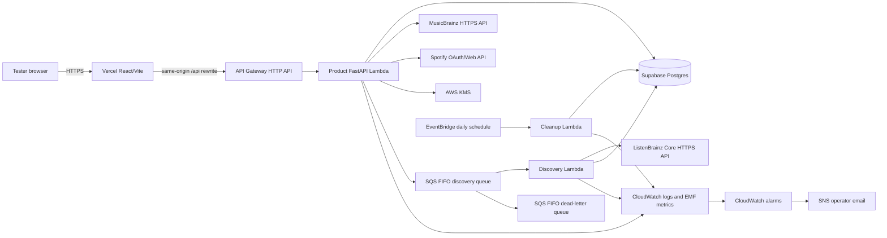

# Product Deployment Architecture Runbook

This runbook describes the Outside the Loop five-user product. The authoritative infrastructure is
`infra/template.yaml`; the browser deployment is configured by `web/vercel.mjs`; the relational
schema is in `supabase/migrations/`.

## Product Boundary

The product is a multi-user, session-authenticated discovery application. Users explicitly choose
MusicBrainz seeds. ListenBrainz supplies independent discovery candidates. Supabase Postgres stores
normalized product records and expiring API caches. Spotify supplies identity, attributed display
and links after ranking, and explicit playlist writes.

There are no local or S3 product dataset reads and no runtime CSV or Parquet input. Product
functions have no S3 environment variables or S3 IAM permissions. The old single-user S3/DynamoDB
demo is a separate compatibility stack condition and remains absent when
`DeployLegacyDemo=false`.

## Topology



There is no CloudFront distribution. Vercel is already the frontend edge and API Gateway is the
backend edge, so adding CloudFront would duplicate caching, TLS, routing, and incident surfaces
without helping this beta.

## Trust Boundaries

| Boundary | Data allowed | Data prohibited |
| --- | --- | --- |
| Browser/Vercel | Opaque session/CSRF cookies, public API JSON, Spotify attribution | Supabase DSN, Spotify client secret or refresh token, KMS data |
| API Lambda | Account-scoped product records, decrypted token in memory, normalized requests | Caller-selected account IDs, local/S3 catalog inputs |
| Discovery Lambda | Internal account/job IDs, explicit seed MBIDs, normalized source facts | Spotify tokens, profile/listening records, request prompts |
| Supabase | Product source of truth and bounded caches | Browser credentials or public `anon` access |
| Logs/metrics | Request ID, route template, latency, status, HMAC correlation, counts | Prompt/body, cookies, auth headers, raw account ID, token, raw provider response, comment |

The Supabase browser roles have all table and function access revoked. AWS connects through the
TLS transaction pooler as `outside_loop_runtime`, a backend-only role with product DML and
read-only migration metadata but no DDL or role/database administration. It can bypass RLS so
OAuth, cleanup, and source-cache system transactions work; ownership is enforced by account-scoped
repositories, foreign keys, constraints, and transactions. Prepared statements are disabled for
Supavisor transaction mode.

## Request And Authentication Flow

1. The frontend redirects to `/api/auth/spotify/start`.
2. AWS stores a one-time hashed OAuth state and a KMS-encrypted PKCE verifier in Postgres.
3. Spotify redirects to the exact Vercel `/api/auth/spotify/callback` URI.
4. AWS exchanges the code, reads only Spotify account identity, encrypts the refresh token with an
   account-bound KMS context, and issues opaque application/CSRF cookies.
5. A new account is `pending`. An operator may approve up to five accounts atomically.
6. Every protected route derives ownership from the active session. Mutations additionally require
   the exact Vercel Origin and double-submit CSRF token.

Sessions expire after seven idle days and 30 absolute days. Logout/revocation invalidates server
state; account deletion cascades all account-owned rows.

## Discovery And Recommendation Flow

1. An approved user searches MusicBrainz and explicitly confirms one to five artist/recording
   MBIDs. MusicBrainz calls use a distributed one-request-per-second slot and positive/negative
   Postgres caching.
2. `POST /discovery/jobs` writes an idempotent discovery job and sends a FIFO SQS message.
3. The worker claims the account-owned job, calls ListenBrainz artist/tag radio and recording
   metadata with bounded retries, and writes normalized entities/candidate edges with provenance and
   expiry.
4. Recommendation generation reads only fresh Supabase entities/edges plus the user's explicit
   blocks. `explicit-discovery-v1` ranks deterministically.
5. Evidence is generated from selected seeds, ListenBrainz source edges, tags, listener counts, and
   source diversity. Unsupported claims fail validation.
6. Only ranked records are resolved to Spotify IDs, first by exact ISRC and then exact normalized
   title/artist. Spotify popularity/profile data never enters the score.
7. The API stores a complete account-owned snapshot before returning it. The user reviews order,
   name, and visibility in a separate mutation.
8. An idempotent explicit export decrypts the current account's refresh token in memory, calls
   Spotify `/me/playlists`, writes items, and persists completion/partial failure.

A source outage yields queued, degraded, insufficient, or failed states. It never triggers a
fallback to repository files, S3, Spotify profile analysis, or invented recommendations.

## AWS Resources

| Resource | Key configuration | Purpose |
| --- | --- | --- |
| `OutsideTheLoopHttpApi` | `$default`, rate 10/s, burst 20, no sensitive access-log fields | Product HTTP edge |
| `OutsideTheLoopApiFunction` | Python 3.12, 768 MiB, 29 s, reserved concurrency 5, X-Ray | OAuth and product API |
| `OutsideTheLoopDiscoveryQueue` | FIFO, AWS-managed SQS KMS, visibility 180 s, max receives 3 | Ordered/idempotent expansion |
| `OutsideTheLoopDiscoveryWorkerFunction` | 512 MiB, 120 s, reserved concurrency 2, partial batch response | ListenBrainz expansion/cache |
| `OutsideTheLoopDiscoveryDlq` | FIFO, 14-day retention | Poison-message isolation |
| `OutsideTheLoopCleanupFunction` | 256 MiB, 60 s, daily schedule | Bounded retention cleanup |
| `OutsideTheLoopTokenKey` | Customer-managed, rotation enabled, retained | Token and PKCE encryption |
| Log groups | 30-day retention | API, worker, cleanup, access logs |
| EMF/alarms/SNS | API/source/database/reconnect/latency/queue/DLQ metrics | Operator detection and email |

The product API role can encrypt/decrypt only with its token key and send only to its discovery
queue. SAM grants the worker the queue-consume permissions generated by its event mapping. Product
roles do not read Secrets Manager at runtime because CloudFormation resolves scoped dynamic
references during deployment; the deployment role can read and rotate only that named secret.

## Persistence

Supabase Postgres is the single product database. It stores users/encrypted token ciphertext,
OAuth state, sessions, explicit seeds, normalized entities/caches/rate slots, jobs/edges, Spotify ID
mappings, recommendations/evidence, preferences, feedback, exports, and evaluations.

Important integrity rules include:

- At most five approved non-deleted accounts.
- At most five active seeds per account.
- One-time atomic OAuth-state consumption.
- Hash-only application session and CSRF values.
- Composite session/account foreign keys for feedback and exports.
- Idempotency uniqueness scoped to the owning account/session.
- Revoked access removes refresh-token ciphertext and active sessions.

Positive source caches generally live seven days, negative cache entries one hour, normalized
entities up to 30 days, and Spotify mappings 24 hours. Scheduled cleanup removes expired/bounded
records; account deletion removes all account-owned records immediately.

## Configuration And Secret Flow

The product runtime secret contains only:

```text
SPOTIFY_APP_CLIENT_ID
SPOTIFY_APP_CLIENT_SECRET
SUPABASE_DB_URL
OBSERVABILITY_HASH_KEY
```

SAM supplies non-secret values such as `APP_BASE_URL`, `AUTH_ALLOWED_ORIGINS`, contact email,
market, queue URL, and KMS ARN. A secret version change requires a stack update so CloudFormation
re-resolves dynamic references. The observability key HMACs internal account correlation; raw
Spotify account IDs are not emitted.

## Packaging Boundary

The deployment builds separate thin contexts for product API, worker, and cleanup. Product locks do
not include PyArrow, OpenAI, Pandas, or NumPy. Preparation and pruning fail if `.parquet`, `.csv`, or
`.env` occurs anywhere in an artifact, and each product package must stay below 128 MiB unzipped.

The legacy API and scheduler have separate contexts and resources under the `DeployLegacy`
condition. Even if their code is packaged by SAM, it is not configured or created in the product
stack when `DeployLegacyDemo=false`.

## Reliability And Recovery

- FIFO deduplication, job claims, and playlist idempotency make retries bounded.
- Partial SQS batch responses retry only failed records; three failed receives move to the DLQ.
- Synchronous product Spotify calls use a four-second timeout without in-request retries. Mapping
  attempts at most 20 uncached candidates and 20 searches within a 12-second elapsed budget, then
  returns honest insufficient coverage instead of overrunning API Gateway.
- Postgres writes that span multiple records run in transactions.
- `/health` is shallow; `/ready` verifies database connectivity without exposing settings.
- Lambda/SQS and custom EMF alarms notify the SNS operator subscription after email confirmation.
- CloudFormation rollback restores the previous application configuration; KMS is retained.
- Supabase backups/PITR are the database recovery boundary. Do not dual-write to DynamoDB.

Operational commands, migration safety, incident response, and rollback are in
[operational-aws-runbook.md](operational-aws-runbook.md). Frontend routing is in
[vercel-deployment-runbook.md](vercel-deployment-runbook.md).
